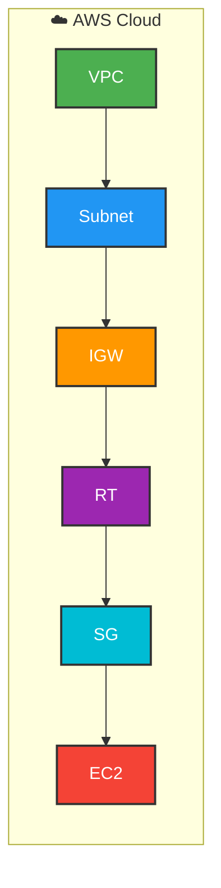
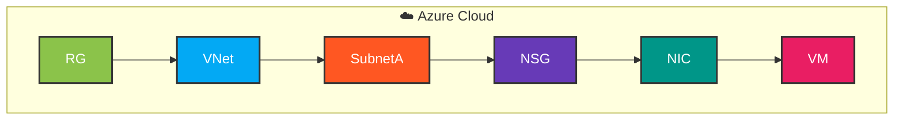

# Terraform Multi‑Cloud Infrastructure Demo

[](https://www.terraform.io/)
[](https://aws.amazon.com/)
[](https://azure.microsoft.com/)
[](LICENSE)

Infrastructure as Code demo using **Terraform** to provision workloads across **AWS** and **Azure**.  
This project showcases multi‑cloud engineering skills, networking/security best practices, and clean repo organization.

## 🚀 Features
### 
- VPC + Public Subnet  
- Internet Gateway + Route Table  
- Security Group (SSH + HTTP)  
- EC2 Instance (Amazon Linux)  

### 
- Resource Group  
- Virtual Network + Subnet  
- Network Security Group (SSH + HTTP)  
- Linux Virtual Machine (Ubuntu)  

## 📂 Repository Structure
```bash
terraform-multi-cloud-infra-demo/
│── aws/
│   └── main.tf        # AWS VPC, Subnet, IGW, Route Table, Security Group, EC2
│── azure/
│   └── main.tf        # Azure Resource Group, VNet, Subnet, NSG, VM
│── README.md          # Project overview and usage
│── LICENSE
│── .gitignore


## ⚡ Quickstart

### Deploy AWS Infrastructure
```bash
cd aws
terraform init
terraform plan
terraform apply


**### Deploy Azure Infrastructure**
cd azure
terraform init
terraform plan
terraform apply

## 🏗️ Architecture (Box Style)

Below is a high‑level ASCII diagram of the AWS and Azure infrastructure provisioned by Terraform:
## 🏗️ Architecture (Box Style)

### ☁️🔶 AWS Cloud
┌───────────────────────────────┐
│   ┌───────────────┐           │
│   │ VPC           │           │
│   └───────────────┘           │
│       │                       │
│   ┌───────────────┐           │
│   │ Subnet        │           │
│   └───────────────┘           │
│       │                       │
│   ┌───────────────┐           │
│   │ Internet GW   │           │
│   └───────────────┘           │
│       │                       │
│   ┌───────────────┐           │
│   │ Route Table   │           │
│   └───────────────┘           │
│       │                       │
│   ┌───────────────┐           │
│   │ Security Group│           │
│   └───────────────┘           │
│       │                       │
│   ┌───────────────┐           │
│   │ EC2 Instance  │           │
│   └───────────────┘           │
└───────────────────────────────┘


### ☁️🔷 Azure Cloud
┌───────────────────────────────┐
│   ┌───────────────┐           │
│   │ Resource Group│           │
│   └───────────────┘           │
│       │                       │
│   ┌───────────────┐           │
│   │ Virtual Net   │           │
│   └───────────────┘           │
│       │                       │
│   ┌───────────────┐           │
│   │ Subnet        │           │
│   └───────────────┘           │
│       │                       │
│   ┌───────────────┐           │
│   │ NSG           │           │
│   └───────────────┘           │
│       │                       │
│   ┌───────────────┐           │
│   │ NIC           │           │
│   └───────────────┘           │
│       │                       │
│   ┌───────────────┐           │
│   │ Linux VM      │           │
│   └───────────────┘           │
└───────────────────────────────┘

## 🔄 Workflow
- Initialize Terraform → terraform init
- Plan Infrastructure → terraform plan
- Apply Changes → terraform apply
- Destroy Resources → terraform destroy (when cleaning up)

## 📖 Learning Outcomes
- Demonstrates multi‑cloud provisioning with Terraform.
- Shows understanding of networking, security, and compute across providers.
- Provides a recruiter‑ready portfolio project with clean structure and documentation.

## 🔮 Future Work
- Add variables.tf and outputs.tf for parameterization  
- Integrate Terraform modules for reusability  
- Expand with load balancers, storage, and monitoring  
- Add CI/CD pipeline for automated deployments  
- Extend to GCP for full tri‑cloud demo  
```

## 🏗️ Architecture (Mermaid)




